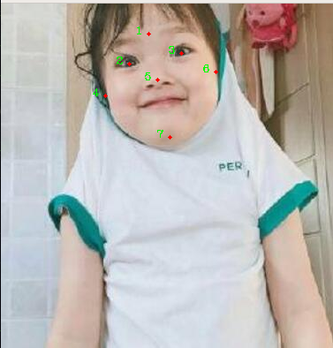

## 基于opencv的标注工具
* 该标注工具有两种方式，`rectangle`&&`points` 默认情况下是points，想要用rectangle，把注释清掉，自己改改。 
* 单击左键标注关键点，脚本中自带恢复标注功能，如果标注中断，在保证图片文件夹内图片顺序不变的情况下可以自动恢复标注。 
* 默认标注`7-key-points`可以自己修改， 
	* 摁`s`保存标注点，自动下一张， 
	* 在摁`s`之前，摁`r` 重新标注本张图片 

标注顺序如下所示	

